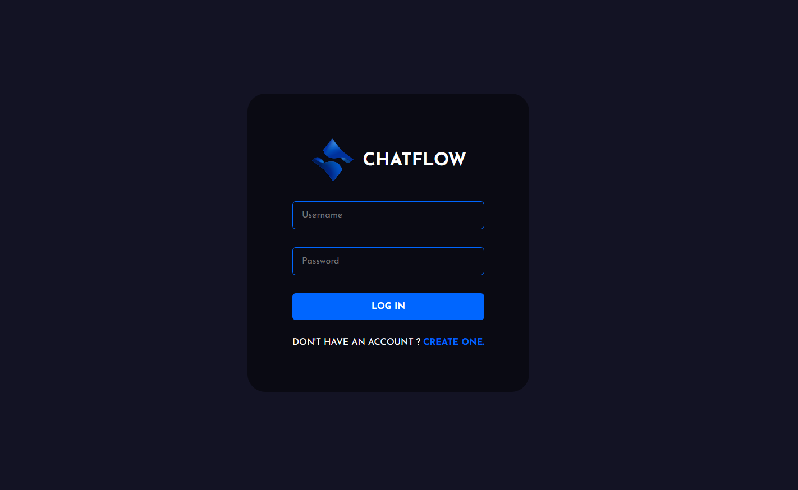
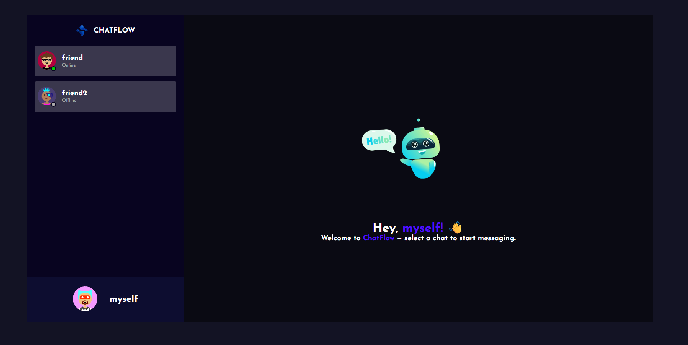
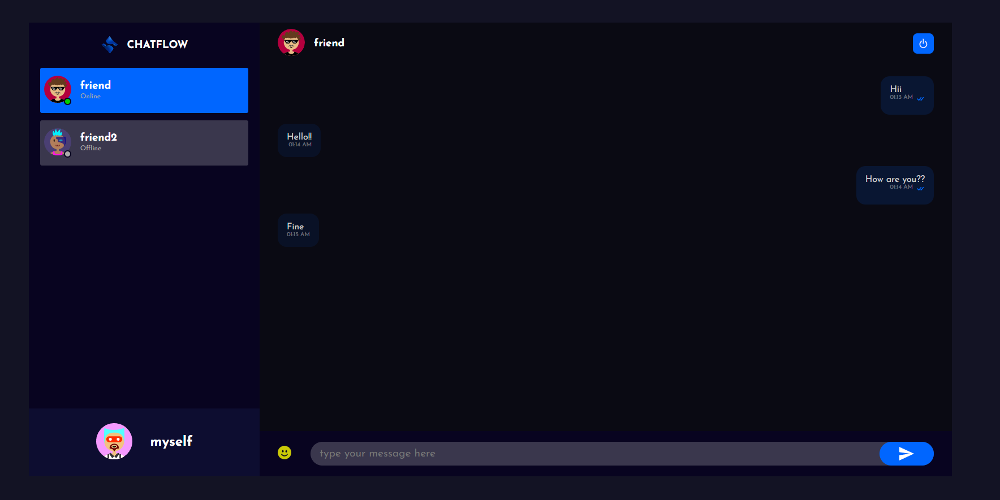

# ChatFlow 💬

**ChatFlow** is a modern, full-stack real-time chat application built with **React**, **Node.js**, **Express**, **MongoDB**, and **Socket.IO**. It enables users to communicate instantly, track online/offline status, see typing indicators, and get read receipts—all within a responsive and intuitive interface.

---

## 📸 Screenshots

To display your screenshots in this section, create a folder named `screenshots` in your project's root directory and ensure the filenames match those in the table below.

| Login Page | Chat Interface | Messaging View |
| :--- | :--- | :--- |
|  |  |  |


---

## 🌟 Features

* **Real-time Messaging:** Low-latency message delivery using **Socket.IO** event-driven architecture.
* **Presence Tracking:** Instant online/offline status updates for a "live" feel.
* **Interactive UX:** Real-time typing indicators and message delivery/read receipts.
* **Message Management:** Synchronized message deletion across all active clients.
* **Responsive Design:** A polished, mobile-first UI built with **Styled-Components**.

---

## 🛠 Tech Stack

### Frontend
* **React:** Functional components and Hooks for state management.
* **Styled-Components:** Scoped, dynamic CSS-in-JS.
* **Axios:** Handling asynchronous HTTP requests to the backend.

### Backend
* **Node.js & Express:** Robust REST API and server logic.
* **Socket.IO:** Real-time, bidirectional communication layer.

### Database
* **MongoDB & Mongoose:** Scalable NoSQL storage and object modeling.

---

## 🚀 Getting Started

### Prerequisites
* **Node.js** (v14 or higher)
* **MongoDB** (Local instance or MongoDB Atlas URI)

### Installation & Setup

1.  **Clone the Repository**
    ```bash
    git clone [https://github.com/yourusername/ChatFlow.git](https://github.com/yourusername/ChatFlow.git)
    cd ChatFlow
    ```

2.  **Configure Backend**
    * Navigate to the backend directory: `cd backend`
    * Install dependencies: `npm install`
    * Create a `.env` file in the `backend` folder:
        ```env
        PORT=5000
        MONGO_URI=your_mongodb_connection_string
        JWT_SECRET=your_secret_key
        ```
    * Start the server: `npm start`

3.  **Configure Frontend**
    * Navigate to the frontend directory: `cd ../frontend`
    * Install dependencies: `npm install`
    * Start the development server: `npm start`

---
## Architecture Overview

ChatFlow is a **real-time chat application** built with **React**, **Node.js**, **Express**, **MongoDB**, and **Socket.IO**.

- **Event Handling:** Real-time message delivery, typing indicators, and presence updates via Socket.IO.  
- **Persistence:** MongoDB stores messages and user metadata, supporting message deletion.  
- **State Synchronization:** React state ensures smooth UI updates with live events.  
- **User Presence:** Online/offline status updated in real-time.  
- **Typing Indicators:** Shows when participants are composing messages.  
- **Optimized Data Flow:** JSON payloads for efficient communication between frontend and backend.

---

